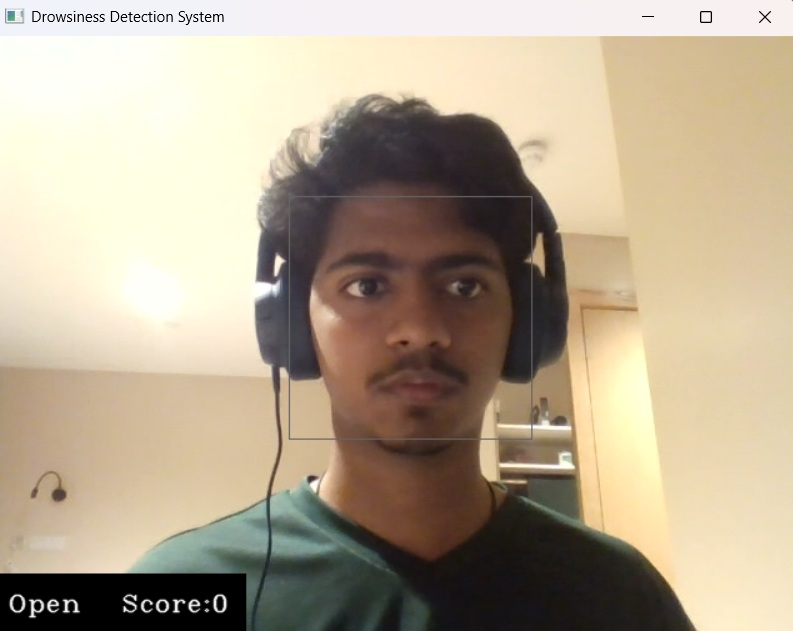
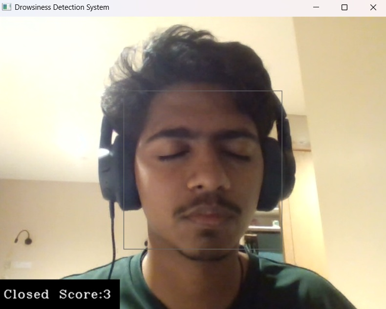
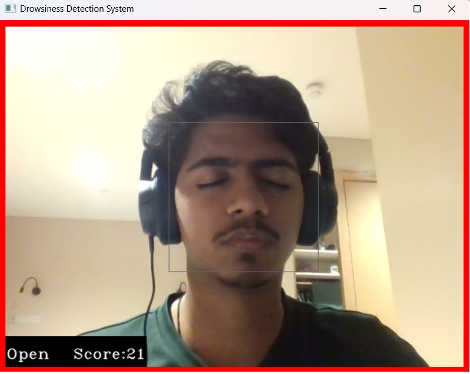
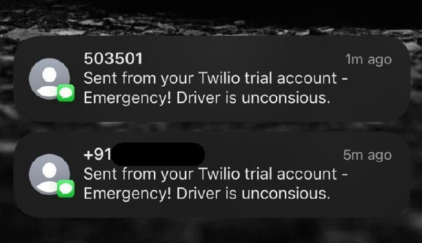

# Drowsiness Detection System

A real-time drowsiness detection system that uses computer vision and deep learning to monitor eye states and alert users when they appear to be falling asleep. This system is particularly useful for drivers, students, or anyone who needs to stay alert during long periods of work.

## 🚀 Features

- **Real-time Eye Detection**: Uses Haar cascade classifiers to detect faces and eyes in real-time
- **CNN-based Classification**: Employs a trained Convolutional Neural Network to classify eye states (open/closed)
- **Drowsiness Scoring**: Implements a scoring system that tracks consecutive closed-eye periods
- **Multi-level Alert System**: 
  - Audio alerts when drowsiness is detected
  - Emergency SMS notifications to contacts
- **Location Services**: Includes location information in emergency alerts
- **Visual Feedback**: Provides real-time status display and warning indicators
- **Easy to Use**: Simple interface with clear instructions

## 📋 Prerequisites

Before running this project, ensure you have the following installed:

- Python 3.7 or higher
- Webcam or camera device
- Windows, macOS, or Linux operating system

## 🛠️ Installation

### Step 1: Clone or Download the Project

Download the project files to your local machine and navigate to the project directory.

### Step 2: Create a Virtual Environment

```bash
# Create a new virtual environment
python -m venv dd1

# Activate the virtual environment
# On Windows:
dd1\Scripts\activate
# On macOS/Linux:
source dd1/bin/activate
```

### Step 3: Install Dependencies

```bash
pip install -r requirements.txt
```

This will install all the required packages:
- OpenCV (4.12.0.88) - Computer vision library
- TensorFlow (2.20.0) - Deep learning framework
- Keras (3.11.3) - High-level neural network API
- NumPy (2.2.6) - Numerical computing
- Matplotlib (3.10.7) - Plotting library
- Pygame (2.6.1) - Audio playback
- Pillow (11.3.0) - Image processing
- Twilio (8.10.0) - SMS messaging service
- Geocoder (1.38.1) - Location services

### Step 4: Configure Twilio (Optional)

If you want to use SMS emergency alerts:

#### Option 1: Environment Variables (Recommended)

**Windows PowerShell:**
```powershell
$env:TWILIO_ACCOUNT_SID="your_account_sid_here"
$env:TWILIO_AUTH_TOKEN="your_auth_token_here"
$env:TWILIO_PHONE_NUMBER="your_twilio_phone_number"
$env:EMERGENCY_CONTACTS="+1234567890,+0987654321"
```

**Windows Command Prompt:**
```cmd
set TWILIO_ACCOUNT_SID=your_account_sid_here
set TWILIO_AUTH_TOKEN=your_auth_token_here
set TWILIO_PHONE_NUMBER=your_twilio_phone_number
set EMERGENCY_CONTACTS=+1234567890,+0987654321
```

**macOS/Linux:**
```bash
export TWILIO_ACCOUNT_SID="your_account_sid_here"
export TWILIO_AUTH_TOKEN="your_auth_token_here"
export TWILIO_PHONE_NUMBER="your_twilio_phone_number"
export EMERGENCY_CONTACTS="+1234567890,+0987654321"
```

#### Option 2: Config File

1. **Copy the example config file:**
   ```bash
   cp config_example.py config.py
   ```

2. **Edit config.py with your Twilio credentials:**
   ```python
   TWILIO_ACCOUNT_SID = 'your_actual_account_sid'
   TWILIO_AUTH_TOKEN = 'your_actual_auth_token'
   TWILIO_PHONE_NUMBER = 'your_twilio_phone_number'
   EMERGENCY_CONTACTS = ['+1234567890', '+0987654321']
   ```

3. **Update the main script to use config file** (modify `drowsiness detection.py`):
   ```python
   from config import TWILIO_ACCOUNT_SID, TWILIO_AUTH_TOKEN, TWILIO_PHONE_NUMBER, EMERGENCY_CONTACTS
   ```

#### Getting Twilio Credentials

1. **Sign up for Twilio**: Visit [twilio.com](https://www.twilio.com)
2. **Get your credentials** from the Twilio Console:
   - Account SID
   - Auth Token
   - Phone Number (purchase one if needed)
3. **Add emergency contacts** in the format: `+1234567890`


## 🎯 Usage

### Running the Drowsiness Detection System

1. **Activate the virtual environment** (if not already activated):
   ```bash
   dd1\Scripts\activate  # Windows
   # or
   source dd1/bin/activate  # macOS/Linux
   ```

2. **Run the main detection script**:
   ```bash
   python "drowsiness detection.py"
   ```

3. **Using the system**:
   - Position yourself in front of the camera
   - Ensure good lighting for optimal face detection
   - The system will display a live video feed with detection overlays
   - A drowsiness score will be shown at the bottom of the screen
   - **Alert Levels:**
     - **Score > 20**: Audio alarm plays
     - **Score > 40**: Emergency SMS sent to contacts (if configured)
   - Press 'q' to quit the application

### Training a New Model (Optional)

If you want to train the model with your own data:

1. **Prepare your dataset**:
   - Create directories: `data/train/` and `data/valid/`
   - Inside each directory, create subdirectories: `Open/` and `Closed/`
   - Place eye images in the appropriate subdirectories

2. **Run the training script**:
   ```bash
   python model.py
   ```

3. **Update the model path** in `drowsiness detection.py` if you save the model with a different name.

## 📁 Project Structure

```
Drowsiness detection/
├── drowsiness detection.py    # Main detection script
├── model.py                   # CNN model training script
├── requirements.txt           # Python dependencies
├── alarm.wav                  # Alarm sound file
├── README.md                  # This file
├── haar cascade files/        # Haar cascade classifiers
│   ├── haarcascade_frontalface_alt.xml
│   ├── haarcascade_lefteye_2splits.xml
│   └── haarcascade_righteye_2splits.xml
├── models/                    # Trained model
│   └── cnncat2_new.h5        
└── dd1/                      # Virtual environment
```

## 🔧 How It Works

### 1. Face and Eye Detection
The system uses OpenCV's Haar cascade classifiers to detect:
- Faces in the video frame
- Left and right eyes within detected faces

### 2. Eye State Classification
Each detected eye is:
- Converted to grayscale
- Resized to 24x24 pixels
- Normalized to values between 0 and 1
- Fed into a CNN model for classification

### 3. Drowsiness Scoring
- **Score increases** when both eyes are detected as closed
- **Score decreases** when at least one eye is open
- **Score resets to 0** if it goes negative

### 4. Alert System
When the drowsiness score exceeds 15:
- An alarm sound plays
- A pulsing red border appears around the video
- The current frame is saved as `image.jpg`

## 📊 Model Architecture

The CNN model consists of:
- **3 Convolutional layers** with 32, 32, and 64 filters
- **MaxPooling layers** for dimensionality reduction
- **Dropout layers** (0.25 and 0.5) for regularization
- **Dense layer** (128 neurons) for feature combination
- **Output layer** (2 neurons) for binary classification

## 🎨 Screenshots and Outputs

### System Interface


*Main detection window showing face detection and status display*

### Drowsiness Detection in Action


*System detecting closed eyes with drowsiness score*

### Alert System


*Red warning border and alarm activation when drowsiness is detected*

### SMS Emergency Notifications


*SMS notification received on phone showing emergency alert*

## ⚙️ Configuration

### Adjusting Sensitivity
You can modify the drowsiness threshold in `drowsiness detection.py`:
```python
if(score > 15):  # Change this value to adjust sensitivity
```

### Camera Settings
To use a different camera, change the camera index:
```python
cap = cv2.VideoCapture(0)  # Change 0 to 1, 2, etc. for different cameras
```

### Audio Settings
To use a different alarm sound, replace `alarm.wav` with your preferred audio file.

## 🐛 Troubleshooting

### Common Issues

1. **Camera not detected**:
   - Ensure your camera is connected and not being used by another application
   - Try changing the camera index in the code

2. **Poor face detection**:
   - Ensure good lighting conditions
   - Position yourself directly in front of the camera
   - Avoid wearing glasses or accessories that might interfere

3. **Model loading errors**:
   - Ensure the model file exists in the `models/` directory
   - Check that all dependencies are properly installed

4. **Audio not playing**:
   - Ensure `alarm.wav` exists in the project directory
   - Check your system's audio settings

### Performance Optimization

- **For better performance**: Reduce the video resolution or frame rate
- **For better accuracy**: Ensure good lighting and clear face visibility
- **For training**: Use a GPU if available for faster model training

## 🤝 Contributing

Feel free to contribute to this project by:
- Reporting bugs
- Suggesting new features
- Improving the documentation
- Optimizing the code


## 🙏 Acknowledgments

- OpenCV community for the Haar cascade classifiers
- TensorFlow/Keras team for the deep learning framework
- Contributors to the various Python libraries used in this project


